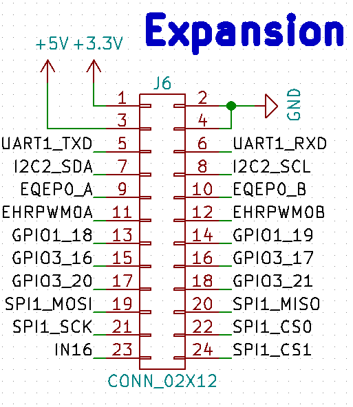

Expansion Connector
===================

Here's the corresponding part in the schematic:

The connector is oriented as follows, when looking at it from the front on the
board

+--+---+-----+---+----+
|1 | 3 | ... |21 | 23 |
+--+---+-----+---+----+
|2 | 4 | ... |22 | 24 |
+--+---+-----+---+----+

.. important:: The expansion connector pins are directly brought out from the
               AM335x SoC. Anything > 3.3V on these pins will permanently
               damage the board! Also, applying signals before the board has
               booted to any of these pins will damage the board.

Currently, the muxing on these pins is fixed but future SW revisions will add
the ability to configure the pinmux on these pins individually to make them GPIOs
or select alternate functionality available on these pins using the "config-pin"
utility.

The GPIO and other peripherals can be used the normal way as in any embedded
Linux system using the sysfs interface. TODO: Add examples here.
