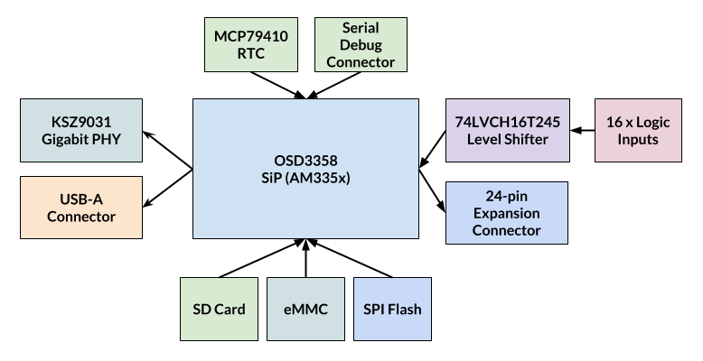

Hardware Architecture
=====================

OSD3358-SM SiP
--------------

The `OSD3358-SM <https://octavosystems.com/octavo_products/osd335x-sm/>`_ is a
System-in-Package from Octavo Systems that integrates the AM335x SoC, DDR RAM,
TPS65217 PMIC, a 3.3V LDO and a 4KB EEPROM into a single 21x21mm^2 256-ball BGA.
It can be also referred to as a "BeagleBone-on-a-chip". This SiP forms the heart
of the BeagleLogic Standalone Board.

KSZ9031 Gigabit PHY
-------------------

This is connected to the RGMII1 bus of the AM335x SoC. It provides the Gigabit
Ethernet link between the AM335x and the external world. For the external
magnetics an SI-51009-F MagJack from Bel Connectors is used.

eMMC
-----

The prototype boards have a SanDisk SDIN8DE2-4G-I 4GB eMMC part on board. It is
connected to the MMC2 bus of the AM335x SoC. As such, it is not possible to boot
from MMC2 as the AM335x boot ROM can only boot from MMC0 (SD Card) or MMC1 but
with the addition of a SPI Flash, booting becomes possible via u-boot. This is
the reason for having a SPI Flash on board

SPI Flash
---------

There is a Winbond W25Q64 8MB SPI Flash on board connected to the SPI0 bus. The
SPI Flash is present in order to help the board boot from eMMC as the AM335x boot
ROM can only boot from MMC0 (SD Card) or MMC1. So with u-boot on the SPI Flash,
it should be possible to boot from the eMMC on the MMC2 bus.

.. note:: The current version of u-boot does not support booting from MMC2. I
          plan to add support to mainline u-boot for booting from MMC2.

SD Card
-------

The microSD card is connected to the MMC0 bus of the AM335x SoC.

RTC
---

There is an MCP79410 RTC on board connected on the I2C0 bus that can keep track
of time when the board is powered off (after addition of a coin cell that is not
included by default)

Logic Inputs
------------

See :doc:`logic_inputs`

Expansion Connector
--------------------

See :doc:`expansion_connector`

Serial Debug Connector
----------------------

Unlike the BeagleBone Black family of boards, the serial console on this board
is on UART4 instead of UART0. Hence u-boot needs to be rebuilt with
``CONFIG_CONS_INDEX=5`` to get the output of u-boot on the serial console.

The pinout of this 6-pin connector is identical to that of the BeagleBone Black
and related boards.
