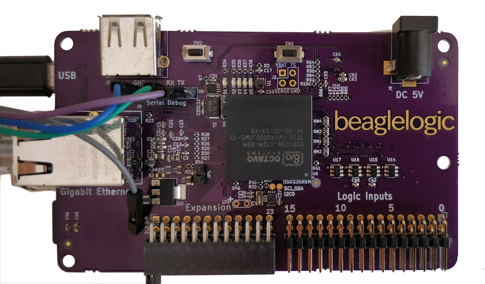

.. BeagleLogic Standalone documentation master file, created by
   sphinx-quickstart on Sun Oct 15 20:52:31 2017.
   You can adapt this file completely to your liking, but it should at least
   contain the root `toctree` directive.

BeagleLogic Standalone
==================================================

.. note:: If you're interested in pre-ordering one of these units when it
          becomes available, please sign up
          `here <https://goo.gl/forms/yqEGdHi0kKeWaJXO2>`_.

BeagleLogic standalone is a turnkey Logic Analyzer built on top of
`BeagleLogic <http://beaglelogic.readthedocs.io>`_ and powered by the
Octavo Systems' OSD3358-SM SiP.

Features:
  * 16 buffered channels @ 100MSa/s - currently up to 5V
  * Gigabit Ethernet
  * 24-pin expansion connector
  * 4GB eMMC
  * SPI Flash
  * USB Host

.. toctree::
   :maxdepth: 1
   :caption: Documentation Contents:

   hardware_architecture
   logic_inputs
   expansion_connector
   errata
