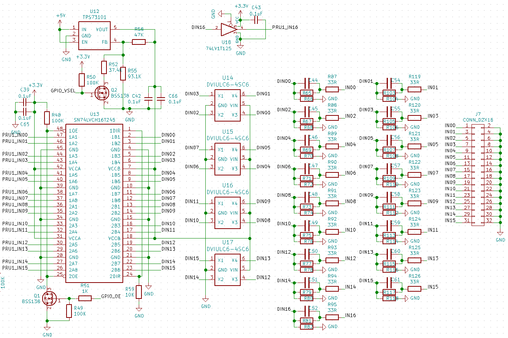

Logic Inputs
============

(right click on image and select "open in new tab" to view full size)

The logic inputs are connected to the SoC through a TI SN74LVCH16T245 logic buffer. The
74LVCH16T245 has two voltage rails. The AM335x side is fixed at 3.3V while the
logic input side is connected to an LDO that can be configured to output either
.3V or 1.8V on the value of a GPIO. If the GPIO is high, it outputs 3.3V, if it
is low, 1.8V is output.

This allows BeagleLogic Standalone the flexibility to choose logic level
threshold for the input - selectable at 1.8V or 3.3V TTL I/O.

The inputs are protected from ESD via a ST DVIULC6-4SC6 diode array.

The inputs are connected via a series 33R resistor to a voltage divider whose
primary purpose is to limit the current through the ESD diode at 12V logic input.
A capacitor in parallel to the series resistor decreases the rise time of the
signal allowing signals up to 100MHz to pass through.

As some of the pins used by the logic analyzer are also pins that are required
by the processor on boot, the OE pin of the 74LVCH16T245 is connected to another
GPIO that is low on boot and goes high on system startup, pulling the OE pin low
to allow external logic signals.
