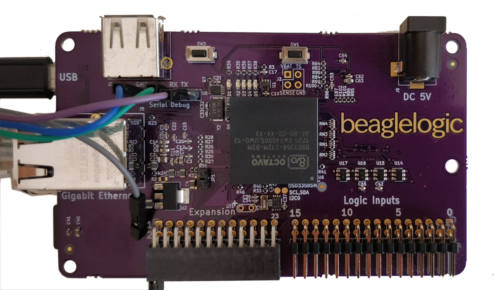

Pictures of the first prototypes
================================

These are the pictures of the first prototypes of the BeagleLogic standalone
board. The PCBs were fabricated by
`OSHPark <https://oshpark.com>`_ and assembled at
`GHI Electronics <https://www.ghielectronics.com>`_.

